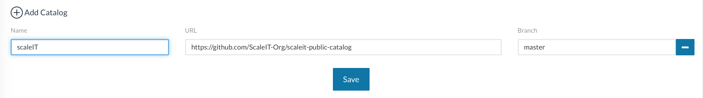
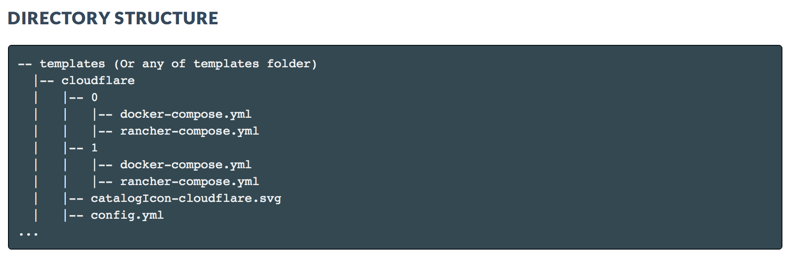
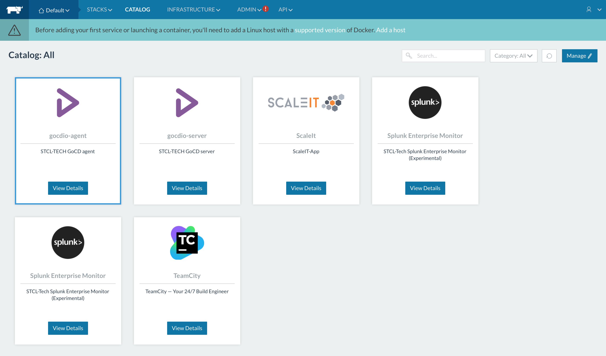
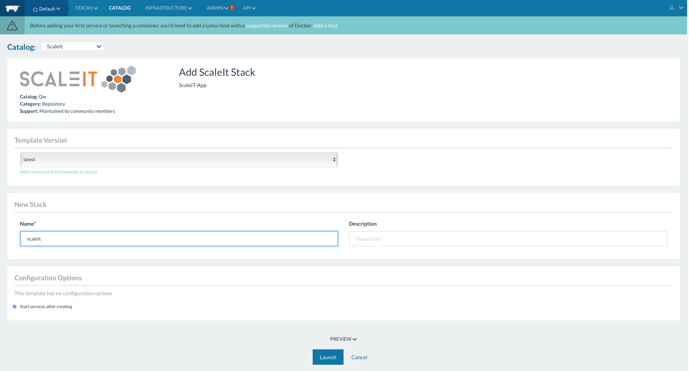

# Rancher catalog

## Integrate catalog
If you want to integrate catalog in your rancher instance, go to **Rancher ADMIN** -> **Settings** and add catalog name and repo link ([https://github.com/ScaleIT-Org/scaleit-public-catalog] for this catalog) like here:


## Entries in catalog
To add or update an app from remote repository start the script autoload.sh in root catalog directory with the link to repository as argument:
```
./autoload.sh -remote [link]
```
Or you can run it local from the root directory of your app:
```
./autoload.sh -local
```

If there is no entry with the app, script creates one, else it add the new version. You can also do it manually, just add a folder like this:



## Result


HowTo and some scrinshots are from http://rancher.com/docs/rancher/v1.2/en/catalog/private-catalog/
